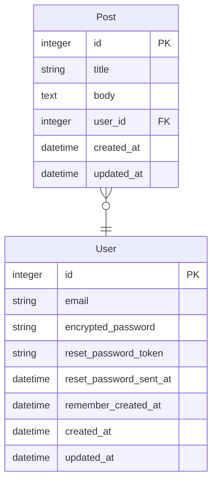
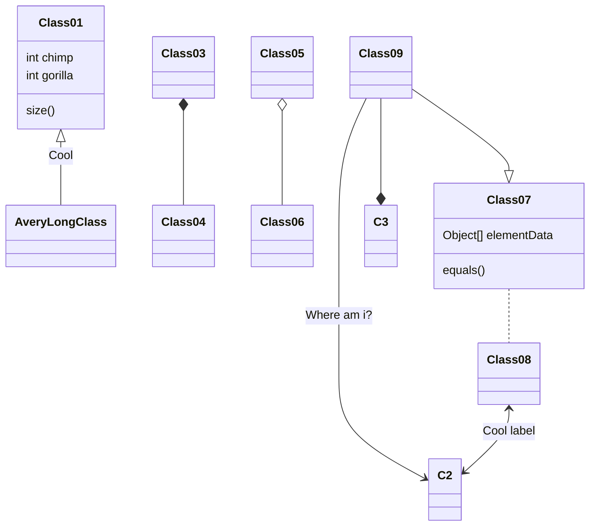

# README

This is my rails app or something, idk?

```mermaid
erDiagram
    %% --------------------------------------------------------
    %% Generated by "Rails Mermaid ERD"
    %% https://github.com/koedame/rails-mermaid_erd
    %% Restore Hash: #eyJzZWxlY3RNb2RlbHMiOlsiUG9zdCIsIlVzZXIiXSwiaXNQcmV2aWV3UmVsYXRpb25zIjpmYWxzZSwiaXNTaG93UmVsYXRpb25Db21tZW50IjpmYWxzZSwiaXNTaG93S2V5Ijp0cnVlLCJpc1Nob3dDb21tZW50Ijp0cnVlLCJpc0hpZGVDb2x1bW5zIjpmYWxzZX0=
    %% --------------------------------------------------------

    %% table name: posts
    Post {
        integer id PK ""
        string title  ""
        text body  ""
        integer user_id FK ""
        datetime created_at  ""
        datetime updated_at  ""
    }

    %% table name: users
    User {
        integer id PK ""
        string email  ""
        string encrypted_password  ""
        string reset_password_token  ""
        datetime reset_password_sent_at  ""
        datetime remember_created_at  ""
        datetime created_at  ""
        datetime updated_at  ""
    }

    Post }o--|| User : ""
```

```mermaid
classDiagram
Class01 <|-- AveryLongClass : Cool
Class03 *-- Class04
Class05 o-- Class06
Class07 .. Class08
Class09 --> C2 : Where am i?
Class09 --* C3
Class09 --|> Class07
Class07 : equals()
Class07 : Object[] elementData
Class01 : size()
Class01 : int chimp
Class01 : int gorilla
Class08 <--> C2: Cool label
```