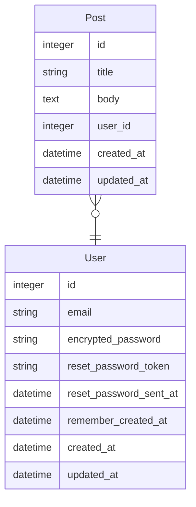

```mermaid
erDiagram
    %% --------------------------------------------------------
    %% Generated by "Rails Mermaid ERD"
    %% https://github.com/koedame/rails-mermaid_erd
    %% Restore Hash: #eyJzZWxlY3RNb2RlbHMiOlsiUG9zdCIsIlVzZXIiXSwiaXNQcmV2aWV3UmVsYXRpb25zIjpmYWxzZSwiaXNTaG93UmVsYXRpb25Db21tZW50IjpmYWxzZSwiaXNTaG93S2V5IjpmYWxzZSwiaXNTaG93Q29tbWVudCI6ZmFsc2UsImlzSGlkZUNvbHVtbnMiOmZhbHNlfQ==
    %% --------------------------------------------------------

    %% table name: posts
    Post {
        integer id  
        string title  
        text body  
        integer user_id  
        datetime created_at  
        datetime updated_at  
    }

    %% table name: users
    User {
        integer id  
        string email  
        string encrypted_password  
        string reset_password_token  
        datetime reset_password_sent_at  
        datetime remember_created_at  
        datetime created_at  
        datetime updated_at  
    }

    Post }o--|| User : ""
```
